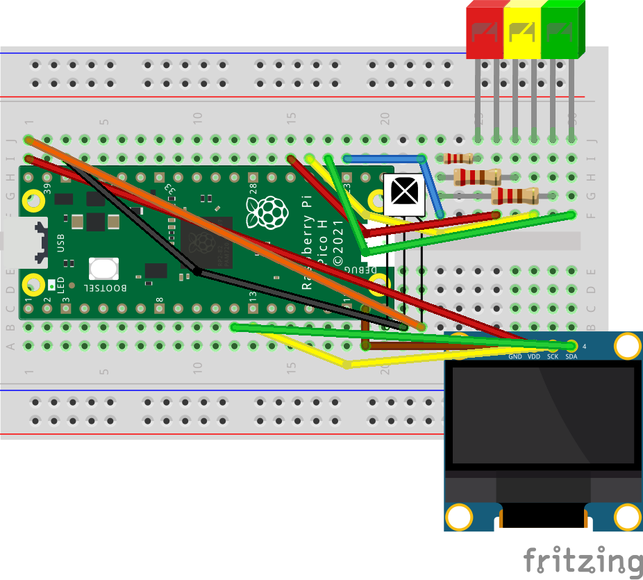
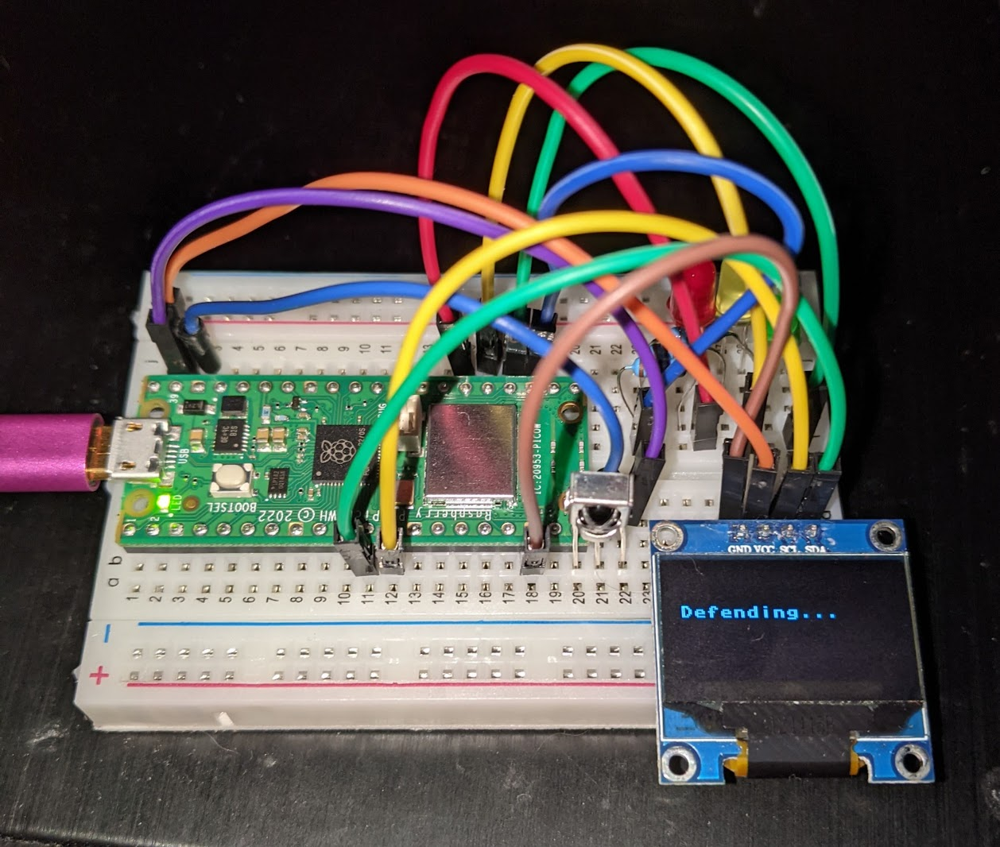
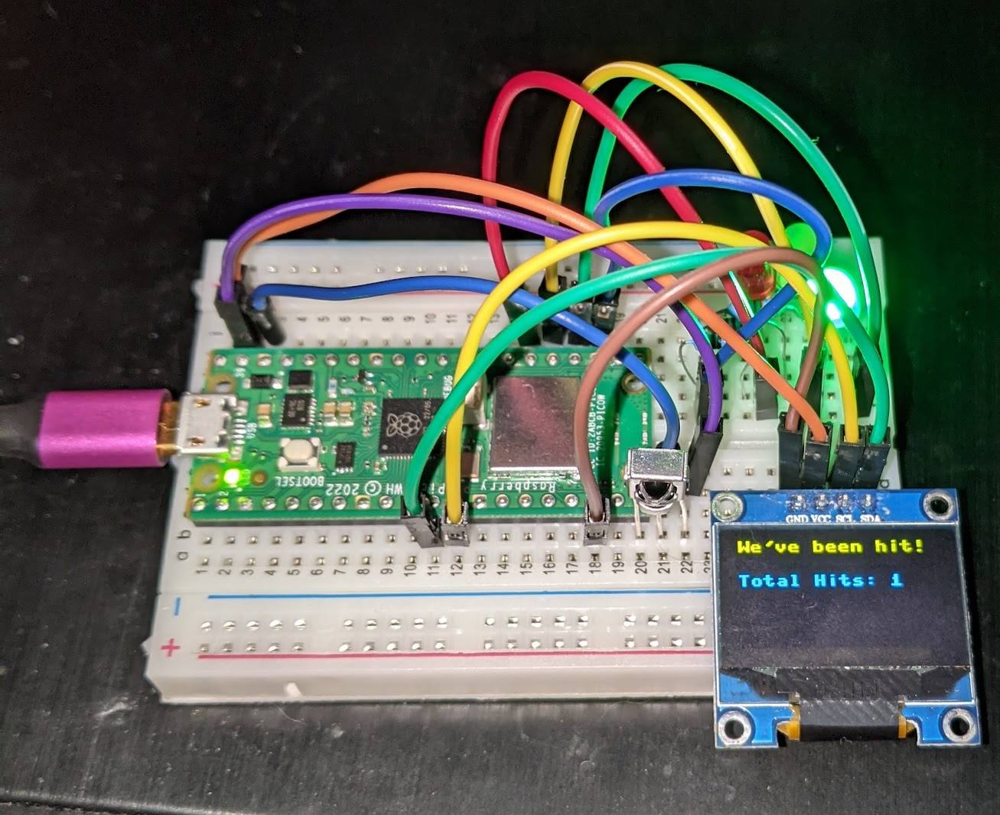
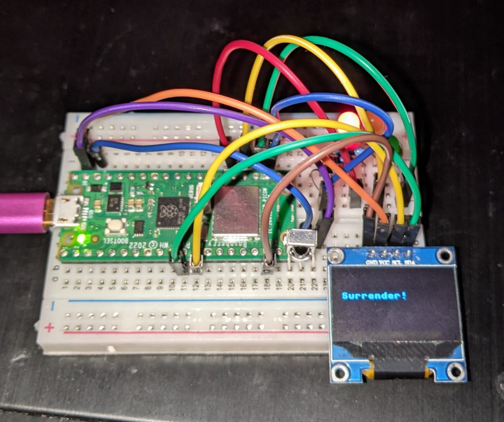

## Table of Contents
- [Introduction](#introduction)
- [Components](#Components)
- [Schmatic](#schematic)
- [Images](#images)
- [Credits](#credits)
- [License](#license)

## Introduction

Remember Laser tag?  

Put one of these on your desk and one on your co-worker's and using the remote, it's a shoot out until 3 shots hit...

EDIT: You can customize the text as you wish. I've added Star Wars themes for the light and dark sides with Peizo buzzer (fits perfecly on Pin 20 (not shown) of the Pico for power and hook the other leg to GND) to play theme if the other side 'wins'

## Components
- [IR Receiver](https://www.amazon.com/gp/product/B06XYNDRGF)
- [Remote](https://www.amazon.com/gp/product/B0C7BPJYH1/)
- Pi Pico
- Leds - Red, Yellow, Green
- 470 Ohm (or similar) resistors

## Schematic 

**OLED Connections**

| GPIO Pin | Connection|
| -------- | --------- |
| GPIO 8   | SDA       |
| GPIO 9   | SCL       |
| GND      | GND       |
| 5V/PIN40 | VCC       |  

**IR Receiver Connections**

| GPIO Pin | Connection|
| -------- | --------- |
| GPIO 15  | IN  (left leg) |
| GND 5    | GND (middle leg) |
| 5V/Pin 40| VCC (right leg|

**LEDs**

| GPIO Pin | Color     |
| -------- | --------- |
| GPIO 18  | Green     |
| GPIO 19  | Yellow    |
| GPIO 20  | Red       |

Each LED also connects to it's own resistor.  

Each resistor connects to the blue jumper which is connected to GND. 

## Images 

## Installation
- git clone https://github.com/jouellnyc/infrared_tag  
- Upload via Thonny to / on your pico pi.

## Credits
- This code relies extensively on https://github.com/peterhinch/micropython_ir/tree/master
- Minor customization was added to ir_rx/test.py and lazer_tag.py

## License 
MIT  
